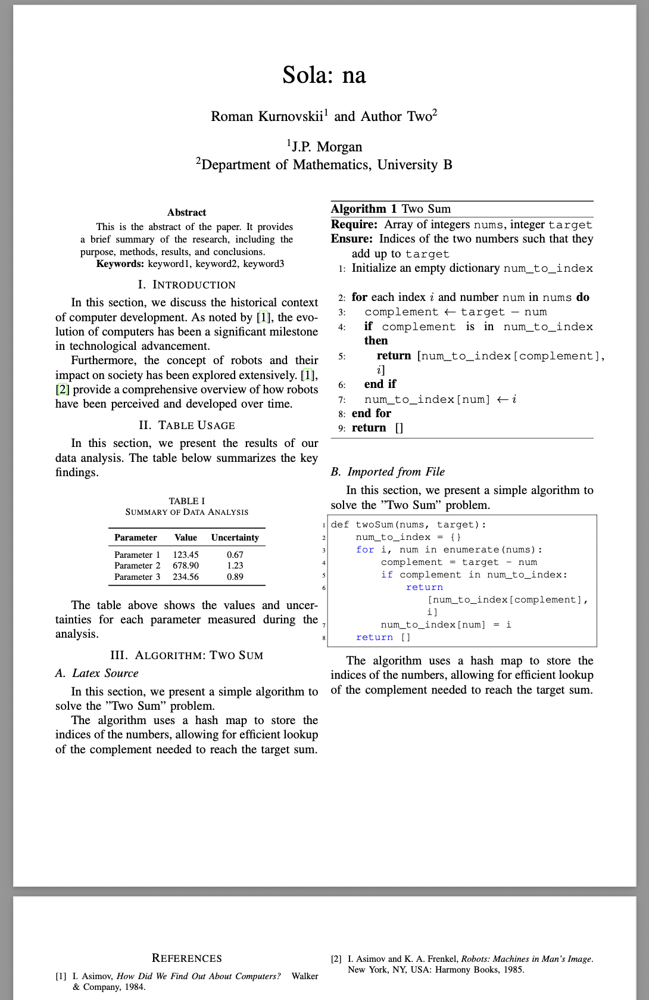

# LaTeX Article Template

Contains a LaTeX template designed for writing scientific articles. It provides a structured layout with separate files for different sections of the article, making it easy to organize and maintain your content.

## Project Structure

- **main.tex**: The main LaTeX file that includes all other sections.
- **abstract.tex**: Contains the abstract of the article.
- **authors.tex**: Lists the authors of the article.
- **title.tex**: Contains the title of the article.
- **sections/**: Directory containing individual sections of the article.
- **files/**: Directory for additional files, such as images or supplementary materials.
- **config/**: Directory for configuration files.
- **bibliography.bib**: Contains the bibliography entries.
- **references.tex**: Includes references to the bibliography.
- **LICENSE**: Contains the license information for the project.

## Usage

1. Use this repository as a template on GitHub.
2. Modify the `main.tex` file to include your content (included sections).
3. Add your sections in the `sections/` directory.
4. Compile the LaTeX document using your preferred LaTeX compiler.

## Dependencies

- A LaTeX distribution (e.g., TeX Live, MiKTeX) is required to compile the document.

## License

This project is licensed under the terms specified in the `LICENSE` file. 